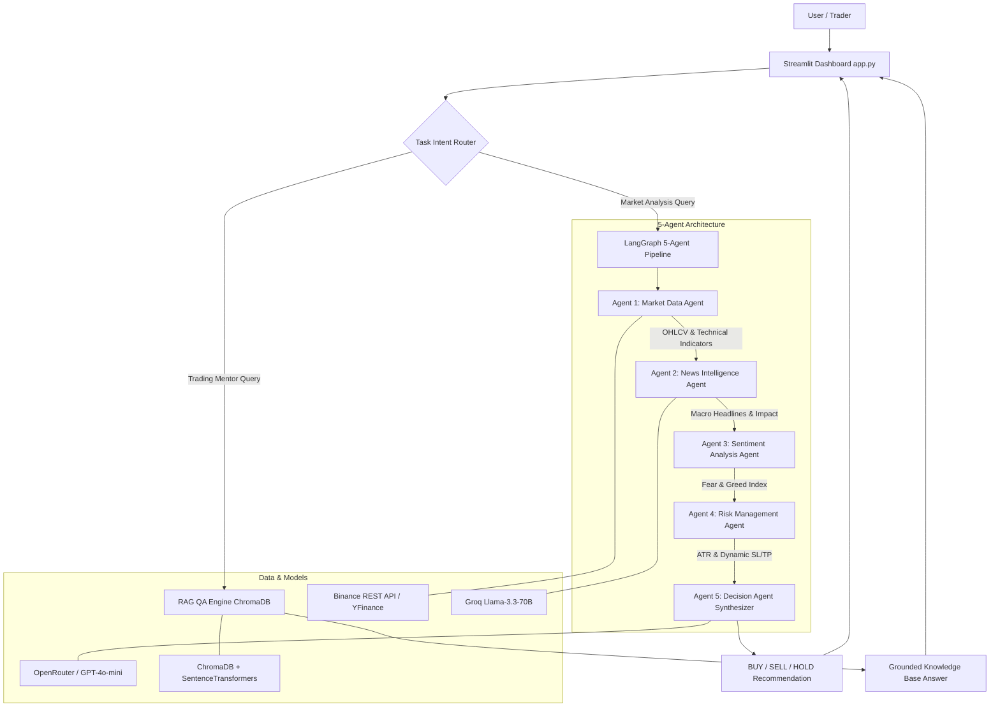
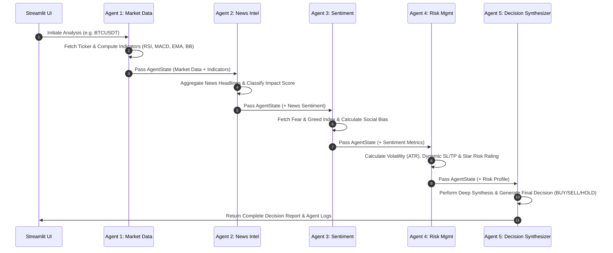

# Multi-Agent AI Intelligence System for Cryptocurrency and Forex Market Analysis and Decision Support

[](https://streamlit.io/)
**Course**: IT41043 — Intelligent Systems / Agentic AI  
**Institution**: Horizon Campus — Faculty of Information Technology  
**Project Type**: Option A — Real-World Problem / Financial Decision Support  

---

## 📌 Executive Summary

The **Multi-Agent AI Intelligence System** is an advanced decision-support platform designed for Cryptocurrency and Forex traders. Instead of relying on a single generic LLM or simple trading bot, the system deploys a team of **5 specialized autonomous AI agents** orchestrated via **LangGraph**. The system combines real-time technical analysis (Binance REST & YFinance), news extraction, Fear & Greed sentiment analysis, dynamic risk management (ATR-based Stop Loss & Take Profit), and deep reasoning synthesis alongside a domain-specific **Retrieval-Augmented Generation (RAG)** knowledge base grounded in 21 trading strategy guides.

---

## 🏛️ System Architecture



---

## 🔄 Agent-to-Agent Communication Sequence Flow



---

## 🤖 Agentic Design Patterns Used (≥3 Implemented)

1. **Orchestrator-Worker Pattern**: Agent 5 (`decision_agent.py`) acts as the Orchestrator synthesizing findings from 4 specialized worker agents (`market_agent`, `news_agent`, `sentiment_agent`, `risk_agent`).
2. **Tool-Use Pattern**: Market Data Agent (`market_agent.py`) executes external tools including Binance REST endpoints, YFinance feeds, and custom technical indicator math algorithms (`indicators.py`).
3. **Planning & Task Decomposition**: LangGraph (`workflow.py`) breaks down complex financial evaluation into structured sequential and parallel state graph steps.
4. **Router Pattern**: Intent Router splits requests between the live 5-agent pipeline and the RAG trading knowledge retriever (`retriever.py`).
5. **Reflection / Self-Critique Pattern**: Risk Agent (`risk_agent.py`) critiques raw trade signals against ATR volatility thresholds and overbought/oversold risk factors.

---

## 📊 Model Selection Strategy & Comparison Table

| Sub-Task | Model (Provider) | Latency | Cost / Token | Context Length | Justification |
| :--- | :--- | :--- | :--- | :--- | :--- |
| **Intent Routing & Classification** | `llama-3.1-8b-instant` (Groq) | ~150ms | Near-Free | 128k | Extremely low latency for intent classification without bottleneck. |
| **News & Text Sentiment** | `llama-3.3-70b-versatile` (Groq) | ~400ms | Very Low | 128k | Exceptional NLP accuracy for parsing complex financial headlines. |
| **Deep Reasoning & Synthesis** | `gpt-4o-mini` (OpenRouter / OpenAI) | ~1.0s | Low/Balanced | 128k | High multi-factor reasoning capability to weigh technicals vs risk. |
| **RAG Grounded QA** | `gemini-2.5-flash` / `all-MiniLM-L6-v2` | ~350ms | Low | 128k / Local | Fast retrieval and strict grounding against ingested trading corpus. |

---

## 📚 RAG Pipeline Architecture & Evaluation

- **Domain Corpus**: 21 comprehensive Markdown trading guides (`rag/corpus/`) covering MACD Divergence, RSI, Bollinger Bands, Risk Management, 1% Rule, ATR Stop Loss, Candlestick Patterns, and Trading Psychology.
- **Chunking Strategy**: `RecursiveCharacterTextSplitter` (`chunk_size=1000`, `chunk_overlap=150`).
- **Embedding Model**: `all-MiniLM-L6-v2` (SentenceTransformers).
- **Vector Database**: `ChromaDB` (`db/chroma_db`).

### Retrieval Benchmark Evaluation (5 Sample Queries)

1. **"What is MACD Divergence?"**  
   - *Retrieved File*: `01_macd_divergence_guide.md`  
   - *Evaluation*: **Highly Relevant** (Retrieved exact definitions of Bullish/Bearish MACD Divergence).
2. **"How do I calculate position size using the 1% risk rule?"**  
   - *Retrieved File*: `07_risk_management_1percent_rule.md`  
   - *Evaluation*: **Highly Relevant** (Retrieved exact mathematical formula and step-by-step example).
3. **"What is the difference between Bullish and Bearish Engulfing candlestick patterns?"**  
   - *Retrieved File*: `05_candlestick_patterns_mastery.md`  
   - *Evaluation*: **Highly Relevant** (Retrieved candlestick pattern breakdown).
4. **"How to set dynamic Stop Loss using ATR (Average True Range)?"**  
   - *Retrieved File*: `09_stop_loss_take_profit_atr.md`  
   - *Evaluation*: **Highly Relevant** (Retrieved 1.5x ATR multiplier rule).
5. **"What are the key differences between the London and Asian Forex trading sessions?"**  
   - *Retrieved File*: `13_forex_market_fundamentals.md`  
   - *Evaluation*: **Highly Relevant** (Retrieved session liquidity and volatility characteristics).

---

## 🚀 Setup & Local Execution Guide

### Prerequisites
- Python 3.10+ installed

### Step-by-Step Installation

```bash
# 1. Clone the repository
git clone https://github.com/your-username/multi-agent-trading-intelligence.git
cd multi-agent-trading-intelligence

# 2. Create and activate virtual environment
python -m venv venv
# On Windows:
venv\Scripts\activate
# On macOS/Linux:
source venv/bin/activate

# 3. Install dependencies
pip install -r requirements.txt

# 4. Ingest domain corpus into ChromaDB
python rag/ingest.py

# 5. Run the Streamlit application
python -m streamlit run app.py
```

> **Note for Windows Users**: If `streamlit` is not recognized on command line, always use `python -m streamlit run app.py`.

---

## 🔒 Secrets Management & Security
API keys are handled via Streamlit secrets (`.streamlit/secrets.toml`) or environment variables (`.env`). Sensitve keys are protected from version control using `.gitignore`.

---

## ⚠️ Known Limitations
1. **Market Hours**: Forex markets are closed during weekends; weekend forex data relies on Friday closing candles or fallback feeds.
2. **API Rate Limits**: Public Binance REST API endpoints are rate-limited to 1,200 requests/minute.

---

## 👨‍💻 Developer & Submission Info
- **Course**: IT41043 Intelligent Systems (Agentic AI)
- **Institution**: Horizon Campus — Faculty of Information Technology
